# Hi, I'm Vladislav Kokin 👋

  <picture>
    <source media="(prefers-color-scheme: dark)" srcset="dark.svg">
    
  </picture>

---

### 👋 About

Frontend Developer, with 2+ years of experience building and maintaining React web applications — responsive
UIs, complex forms, and REST API integrations for both internal business systems and client-facing products with
5,000+ users. Career-changer from the energy sector (boiler operator → Heat Inspection Engineer, 1st category, 5+
years), now pursuing a first degree in IT alongside hands-on development work.

- 🎯 **Focus:** Design systems • Performance Optimisation • AI Agents
- 📍 **Based in:** Moscow, Russia

---

### 🛠 Tech Stack

